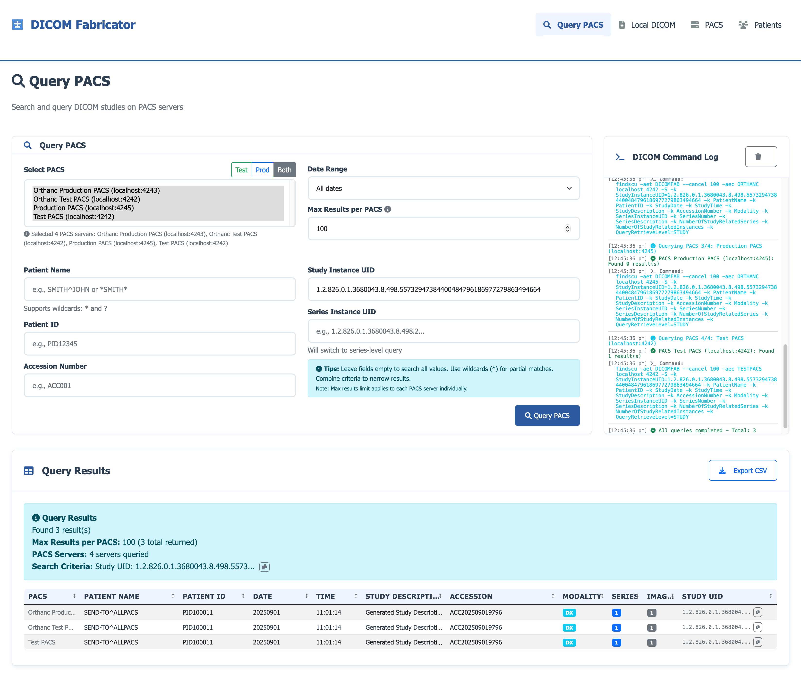

# DICOM Fabricator

A comprehensive DICOM study generation and management system built with Python and Flask. This tool allows you to create synthetic DICOM studies from HL7 ORM messages, manage patient data, and integrate with PACS servers.




*For a detailed visual overview of features and common activities, see [Feature Overview](docs/feature_overview.md)*

## Features

- **HL7 ORM Integration**: Parse HL7 ORM messages and generate corresponding DICOM studies
- **DICOM Generation**: Create synthetic DICOM files with realistic metadata
- **PACS Integration**: Send studies to PACS servers, query existing studies, and perform C-MOVE operations
- **Patient Management**: Comprehensive patient registry with synthetic data generation
- **Web Interface**: Modern Flask-based web application with Bootstrap UI
- **Docker Support**: Easy deployment with Docker Compose for PACS servers

## Architecture

- **Backend**: Python Flask application
- **DICOM Processing**: pydicom library for DICOM manipulation
- **PACS Communication**: DCMTK tools (findscu, storescu, movescu)
- **Frontend**: HTML templates with Bootstrap 5 and JavaScript
- **Database**: JSON-based storage for configurations and patient data

## Prerequisites

- Python 3.8+ (3.11 recommended)
- pyenv (recommended for Python version management)
- DCMTK tools (findscu, storescu, movescu, echoscu, movescu)
- Docker and Docker Compose (for PACS servers)

## Quick Start

### 1. Clone the Repository

```bash
git clone https://github.com/flatmapit/dicom-fabricator.git
cd dicom-fabricator
```

### 2. Set Up Python Environment (Recommended)

#### Install pyenv (if not already installed)

**macOS:**
```bash
brew install pyenv
```

**Ubuntu/Debian:**
```bash
curl https://pyenv.run | bash
```

**Windows:**
```bash
# Install via pip
pip install pyenv-win
```

#### Create and activate Python environment

```bash
# Install Python 3.11 (recommended version)
pyenv install 3.11.0

# Set local Python version for this project
pyenv local 3.11.0

# Create virtual environment
python -m venv .venv

# Activate virtual environment
# On macOS/Linux:
source .venv/bin/activate
# On Windows:
.venv\Scripts\activate
```

### 3. Install Dependencies

```bash
pip install -r config/requirements.txt
```

### 4. Install DCMTK

#### macOS
```bash
brew install dcmtk
```

#### Ubuntu/Debian
```bash
sudo apt-get install dcmtk
```

#### Windows
Download from [DCMTK website](https://dcmtk.org/en/dcmtk/dcmtk-downloads/)

### 5. Start PACS Servers (Optional)

```bash
cd docker
docker-compose up -d
```

This will start two Orthanc PACS servers:
- **Orthanc Test PACS**: localhost:4242 (DICOM), localhost:8042 (HTTP)
- **Orthanc Test PACS 2**: localhost:4243 (DICOM), localhost:8043 (HTTP)

### 6. Run the Application

```bash
python app.py
```

The application will be available at `http://localhost:5001`

## Configuration

### PACS Configuration

Copy the sample configuration and update with your PACS server details:

```bash
cp data/pacs_config.json.sample data/pacs_config.json
```

Edit `data/pacs_config.json` with your PACS server information:

```json
{
  "pacs-server-id": {
    "name": "Your PACS Server",
    "host": "pacs.example.com",
    "port": 104,
    "aet": "DICOMFAB",
    "aec": "PACS"
  }
}
```

### Patient Configuration

Copy the sample patient configuration:

```bash
cp data/patient_config.json.sample data/patient_config.json
```

## Usage

### 1. Generate DICOM Studies

1. Navigate to the Generator page
2. Paste an HL7 ORM message
3. Click "Generate DICOM"
4. View and manage the generated studies

### 2. Send to PACS

1. Select a study from the generated list
2. Choose a PACS server
3. Click "Send to PACS"
4. Monitor the transfer status

### 3. Query PACS

1. Go to the Query PACS page
2. Select a PACS server
3. Enter search criteria
4. View and export results

### 4. Manage PACS Servers

1. Navigate to the PACS Management page
2. Add, edit, or remove PACS configurations
3. Test connectivity
4. View server status

## HL7 ORM Message Format

The application expects HL7 ORM (Order Entry) messages. Key fields:

- **Patient Information**: PID segment
- **Order Information**: OBR segment
- **Accession Number**: OBR-3 (Filler Order Number)
- **Study Description**: OBR-4 (Universal Service ID)

## 🔒 Security Notes

- This tool generates **synthetic data only** - no real patient information
- All generated DICOM files contain fictional data
- PACS credentials and configurations are stored locally
- No data is transmitted to external services

## 🤝 Contributing

### Git Workflow

This project follows a structured Git branching strategy:

- **`main`** - Production-ready code, stable releases
- **`develop`** - Integration branch for features, main development work
- **`feature/*`** - Feature branches for individual development work

#### For New Features:

1. **Start from develop:**
   ```bash
   git checkout develop
   git pull origin develop
   git checkout -b feature/your-feature-name
   ```

2. **Work on your feature:**
   - Make commits with clear, descriptive messages
   - Update CHANGELOG.md for significant changes
   - Keep commits atomic and focused

3. **Complete and merge:**
   ```bash
   git checkout develop
   git merge feature/your-feature-name
   git push origin develop
   ```

For detailed workflow information, see [Git Workflow Documentation](docs/GIT_WORKFLOW.md).

#### General Contributing Guidelines:

1. Fork the repository
2. Create a feature branch from develop
3. Make your changes
4. Add tests if applicable
5. Update CHANGELOG.md
6. Submit a pull request to develop

## 📄 License

This project is licensed under the MIT License - see the [LICENSE](LICENSE) file for details.

## Disclaimer

This software is for **educational and testing purposes only**. It generates synthetic DICOM data and should not be used in production healthcare environments. Always ensure compliance with local healthcare regulations and data protection laws.

## 🆘 Support

For issues and questions:
- Check the [documentation](docs/)
- Review existing [issues](https://github.com/flatmapit/dicom-fabricator/issues)
- Create a new issue with detailed information

## 🔗 Related Projects

- [Orthanc](https://www.orthanc-server.com/) - Open-source PACS server
- [DCMTK](https://dcmtk.org/) - DICOM toolkit
- [pydicom](https://pydicom.github.io/) - Python DICOM library