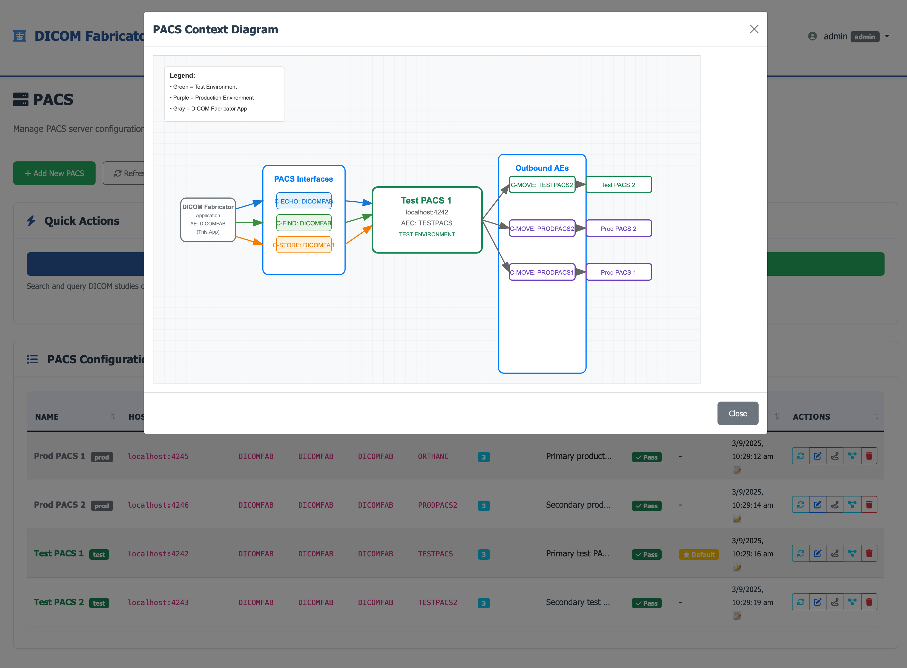

# DICOM Fabricator

DICOM Fabricator (DF) is a tool for PACS administrators and radiology clinical integrations developers. It generates synthetic DICOM studies, manages patient data, and provides PACS integration for testing and development.

> **⚠️ Important**: This tool generates **synthetic data only** for testing purposes. Do not use with real patient data.

## 🎥 Quick Application Demo

<div align="center">

**[▶️ Watch Demo Video (2 minutes)](https://flatmapit-com-videos.s3.amazonaws.com/20250903DicomFab.mov)**

</div>

> **💡 Can't play the video?** Right-click the link above and select "Save link as..." to download the MP4 file locally.

## Key Features

- **🔐 Authentication & Authorization**: Local and enterprise authentication with role-based access control
- **🏥 Multi-PACS Integration**: Query, send, and move studies across multiple image servers
- **📋 Patient Management**: Create and manage synthetic patient records
- **🔄 HL7 ORM Integration**: Generate DICOM studies from HL7 order messages
- **🖥️ Web Interface**: Modern web application with intuitive user interface
- **🐳 Docker Support**: Easy deployment with test PACS servers

## Quick Start

### 1. Clone and Setup
```bash
git clone https://github.com/flatmapit/dicom-fabricator.git
cd dicom-fabricator
python3 -m venv .venv
source .venv/bin/activate  # On Windows: .venv\Scripts\activate
pip install -r config/requirements.txt
```

### 2. Install DICOM Tools
```bash
# macOS
brew install dcmtk

# Ubuntu/Debian
sudo apt-get install dcmtk
```

### 3. Start Test Servers (Optional)
```bash
cd test-pacs
./setup_all_pacs.sh start
```

### 4. Run the Application
```bash
python app.py
```

Visit `http://localhost:5001` to access the web interface.

## Documentation

### Getting Started
- [📖 Installation Guide](docs/getting-started/installation.md) - Detailed setup instructions
- [🚀 First Steps](docs/getting-started/first-steps.md) - Your first DICOM study
- [🎯 Quick Tour](docs/getting-started/quick-tour.md) - Feature overview

### User Guides
- [🖥️ Web Interface](docs/user-guides/web-interface.md) - Using the web application
- [💻 Command Line](docs/user-guides/command-line.md) - Command-line tools
- [🔄 Workflows](docs/user-guides/workflows.md) - Common use cases

### Configuration
- [🔐 Authentication](docs/configuration/authentication.md) - User management and security
- [🏥 PACS Setup](docs/configuration/pacs-setup.md) - Image server configuration
- [👥 Patient Configuration](docs/configuration/patient-config.md) - Patient data settings

### Troubleshooting
- [❓ Common Issues](docs/troubleshooting/common-issues.md) - Frequently asked questions
- [🔧 C-MOVE Troubleshooting](docs/troubleshooting/cmove-troubleshooting.md) - PACS transfer issues

### Development
- [🌿 Git Workflow](docs/development/git-workflow.md) - Contributing guidelines
- [🏗️ Architecture](docs/development/architecture.md) - System design
- [📚 Glossary](docs/glossary.md) - Technical terms explained

## Example Screenshots


*Main dashboard with system status and quick access*


*PACS configuration and routing diagram*

## Role-Based Access Control

DICOM Fabricator uses simplified roles for different user types:

| Role | Description | Access |
|------|-------------|---------|
| `admin` | System administrator | Full access to all features and user management |
| `test_write` | Test environment user | Can query, send, and move studies in test environment |
| `test_read` | Test environment viewer | Can view and query test environment only |
| `prod_write` | Production environment user | Can query, send, and move studies in production |
| `prod_read` | Production environment viewer | Can view and query production environment only |

For enterprise integration, use the `DF-` prefix for Active Directory groups:
- `DF-Admin` → `admin` role
- `DF-TestWrite` → `test_write` role
- `DF-TestRead` → `test_read` role
- `DF-ProdWrite` → `prod_write` role
- `DF-ProdRead` → `prod_read` role

## Security & Compliance

- ✅ **Synthetic Data Only**: All generated data is fictional
- ✅ **Local Storage**: No data transmitted to external services
- ✅ **Role-Based Access**: Granular permission control
- ✅ **Enterprise Ready**: Active Directory and SAML support

## Contributing

We welcome contributions! Please see our [Contributing Guide](docs/development/contributing.md) for details.

### Quick Contribution Steps
1. Fork the repository
2. Create a feature branch: `git checkout -b feature/your-feature`
3. Make your changes
4. Submit a pull request

## License

This project is licensed under the MIT License - see the [LICENSE](LICENSE) file for details.

## Support

- 📖 Check the [documentation](docs/)
- 🐛 Report issues on [GitHub Issues](https://github.com/flatmapit/dicom-fabricator/issues)
- 💬 Join discussions in [GitHub Discussions](https://github.com/flatmapit/dicom-fabricator/discussions)

## Related Projects

- [Orthanc](https://www.orthanc-server.com/) - Open-source PACS server
- [DCMTK](https://dcmtk.org/) - DICOM toolkit
- [pydicom](https://pydicom.github.io/) - Python DICOM library

---

*DICOM Fabricator - Making DICOM testing simple and accessible*
