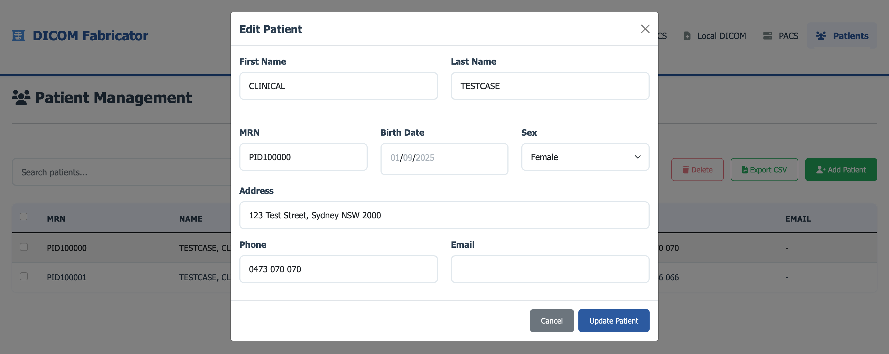
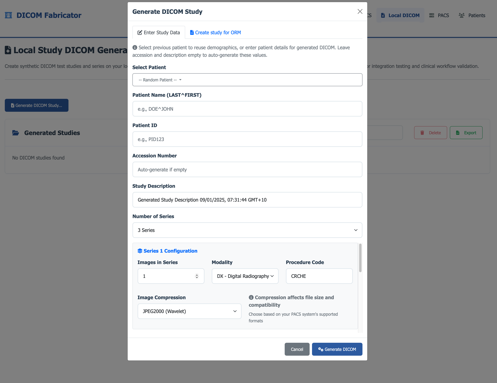
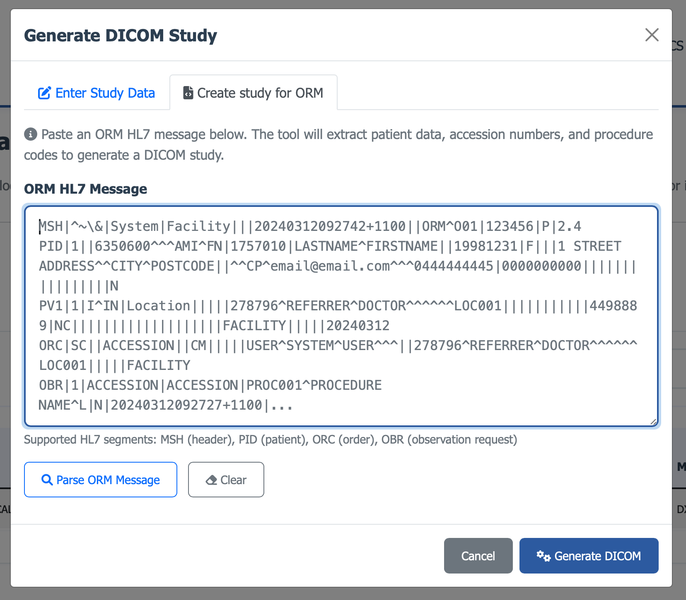
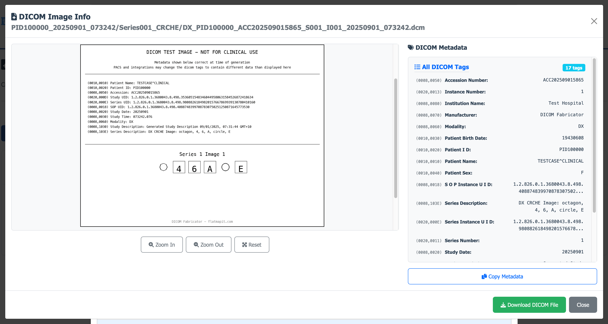
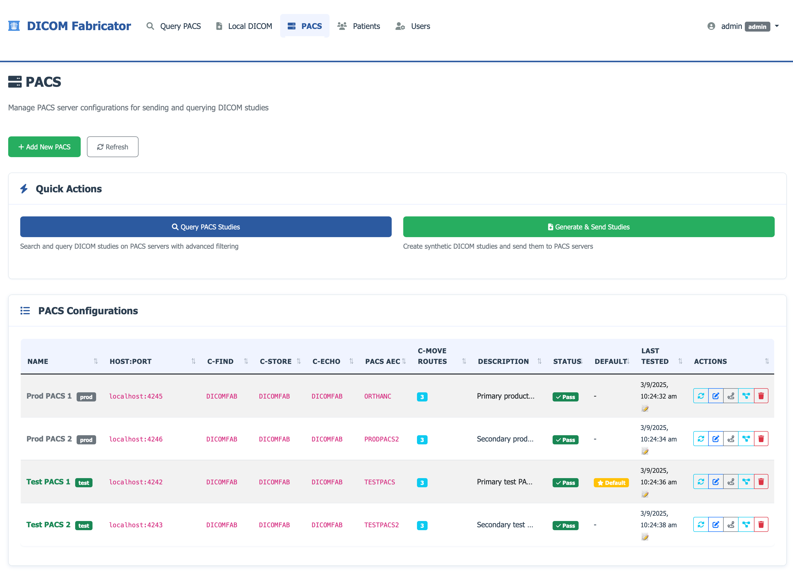
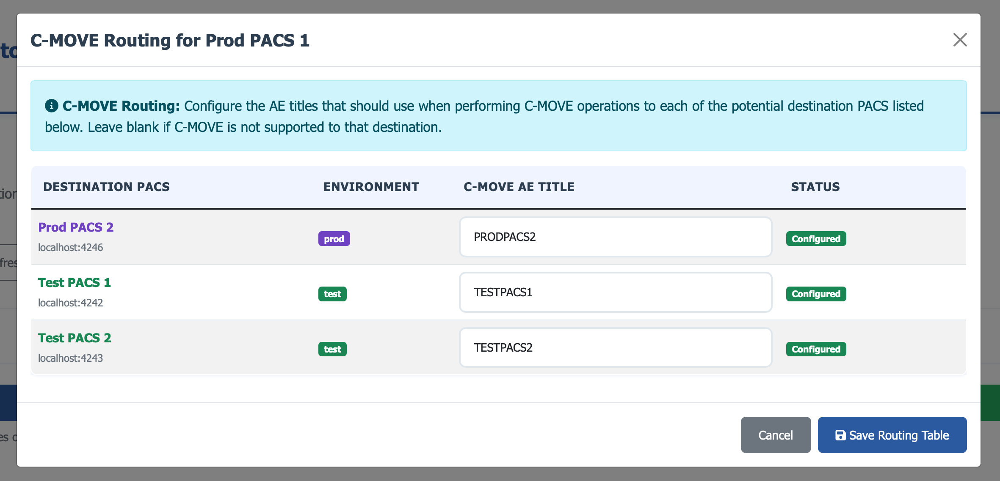
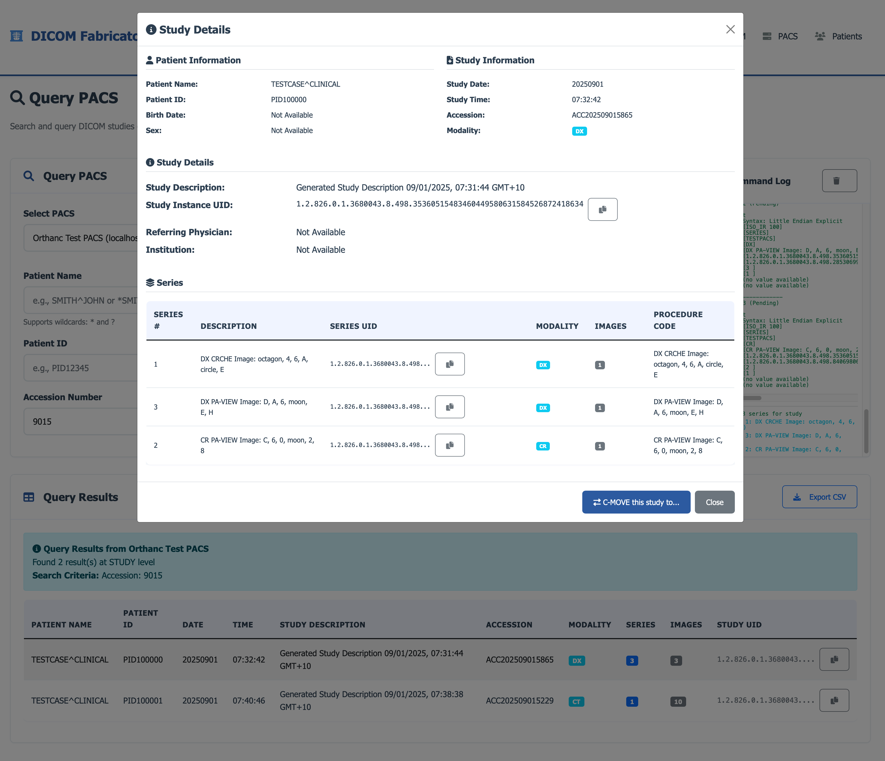

# DICOM Fabricator - Feature Overview

This document provides a visual overview of the key features and common activities supported by DICOM Fabricator.

## Quick Links
- [Feature Permission Matrix](PERMISSIONS_TO_FEATURES.md) - Complete mapping of features to user roles and permissions
- [Authentication Setup](AUTHENTICATION_SETUP.md) - Configuration guide for authentication and user management

## Main Dashboard

The main dashboard provides an overview of the system status and quick access to all major features.

**Key Features:**
- **System Status**: Real-time PACS server connectivity status
- **Quick Stats**: Overview of generated studies and patient records
- **Feature Cards**: Direct access to Patient Management, DICOM Generation, and DICOM Viewer
- **Quick Actions**: Start generating DICOM studies or manage patients

## Patient Management

Create and manage synthetic patient records with realistic demographics.

**Common Activities:**
- **Add New Patients**: Create synthetic patient records with configurable demographics
- **Search & Filter**: Find patients by name, ID, or other criteria
- **Edit Patient Data**: Modify patient information and demographics
- **Export Patient Lists**: Generate CSV exports of patient data
- **Bulk Operations**: Perform actions on multiple patients

## DICOM Generation

Generate synthetic DICOM studies from HL7 ORM messages or manual configuration.

**Common Activities:**
- **HL7 ORM Processing**: Paste HL7 ORM messages to auto-generate studies
- **Manual Configuration**: Set study parameters manually
- **Study Preview**: View generated DICOM metadata before saving
- **Batch Generation**: Create multiple studies with different parameters
- **Template Management**: Save and reuse study configurations

## Generate Studies from ORM

Create DICOM studies directly from HL7 ORM messages with automatic parameter extraction.

**Common Activities:**
- **Paste ORM Message**: Input HL7 ORM messages directly into the interface
- **Automatic Parsing**: Extract patient demographics and study parameters
- **Parameter Review**: Review and edit extracted parameters before generation
- **Study Creation**: Generate complete DICOM studies with proper metadata
- **Validation**: Verify generated studies meet DICOM standards

## DICOM Viewer

View and analyze generated DICOM files with metadata display.

**Common Activities:**
- **File Browser**: Navigate through generated DICOM files
- **Metadata Display**: View detailed DICOM tags and values
- **Image Preview**: See DICOM image thumbnails
- **Search & Filter**: Find specific studies or series
- **Export Options**: Download DICOM files or metadata
- **C-MOVE**: C-MOVE selected DICOM studies to a different PACS.

## PACS Integration

Manage PACS server connections and perform DICOM operations.

**Common Activities:**
- **Server Configuration**: Add and configure PACS server connections
- **Connectivity Testing**: Verify PACS server accessibility
- **Study Transfer**: Send DICOM studies to PACS servers
- **Query Operations**: Search for studies on PACS servers
- **C-MOVE Operations**: Transfer studies between PACS servers

## PACS Query

Search and retrieve studies from connected PACS servers.

**Common Activities:**
- **Study Search**: Query one or many PACS servers for specific criteria
- **Advanced Filters**: Use multiple criteria for precise searches
- **Result Display**: View query results with study details
- **Study Retrieval**: Download studies from PACS servers
- **Export Results**: Save query results in various formats

## Access Control and Permissions

DICOM Fabricator includes role-based access control to manage user permissions across different environments.

**Key Roles:**
- **Admin**: Full system access, user management, and PACS administration
- **Test Write/Read**: Access to test environment PACS operations
- **Prod Write/Read**: Access to production environment PACS operations

For detailed permission mappings, see the [Feature Permission Matrix](PERMISSIONS_TO_FEATURES.md).

## Getting Started Workflow

1. **Setup**: Configure PACS servers and patient data
2. **Generate**: Create DICOM studies from HL7 messages or manual input
3. **Review**: Use the DICOM viewer to verify generated studies
4. **Transfer**: Send studies to PACS servers for testing
5. **Query**: Search and retrieve studies from PACS servers

---

*This document provides a visual overview of the key features and common activities supported by DICOM Fabricator.*
