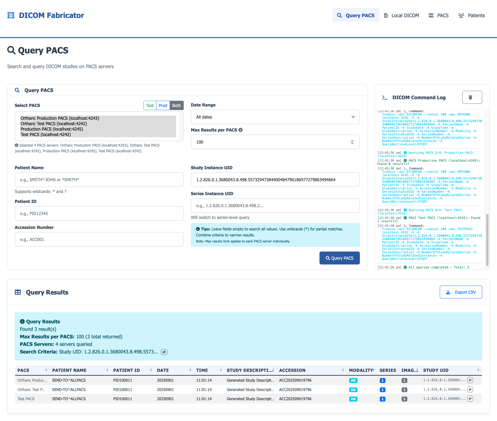

# DICOM Fabricator - Feature Overview

This document provides a visual overview of the key features and common activities supported by DICOM Fabricator.

## 🏠 Main Dashboard

The main dashboard provides an overview of the system status and quick access to all major features.

**Key Features:**
- **System Status**: Real-time PACS server connectivity status
- **Quick Stats**: Overview of generated studies and patient records
- **Feature Cards**: Direct access to Patient Management, DICOM Generation, and DICOM Viewer
- **Quick Actions**: Start generating DICOM studies or manage patients

## 👥 Patient Management

Create and manage synthetic patient records with realistic demographics.

**Common Activities:**
- **Add New Patients**: Create synthetic patient records with configurable demographics
- **Search & Filter**: Find patients by name, ID, or other criteria
- **Edit Patient Data**: Modify patient information and demographics
- **Export Patient Lists**: Generate CSV exports of patient data
- **Bulk Operations**: Perform actions on multiple patients

## 🔧 DICOM Generation

Generate synthetic DICOM studies from HL7 ORM messages or manual configuration.

**Common Activities:**
- **HL7 ORM Processing**: Paste HL7 ORM messages to auto-generate studies
- **Manual Configuration**: Set study parameters manually
- **Study Preview**: View generated DICOM metadata before saving
- **Batch Generation**: Create multiple studies with different parameters
- **Template Management**: Save and reuse study configurations

## 👁️ DICOM Viewer

View and analyze generated DICOM files with metadata display.

**Common Activities:**
- **File Browser**: Navigate through generated DICOM files
- **Metadata Display**: View detailed DICOM tags and values
- **Image Preview**: See DICOM image thumbnails
- **Search & Filter**: Find specific studies or series
- **Export Options**: Download DICOM files or metadata

## 🏥 PACS Integration

Manage PACS server connections and perform DICOM operations.

**Common Activities:**
- **Server Configuration**: Add and configure PACS server connections
- **Connectivity Testing**: Verify PACS server accessibility
- **Study Transfer**: Send DICOM studies to PACS servers
- **Query Operations**: Search for studies on PACS servers
- **C-MOVE Operations**: Transfer studies between PACS servers

## 🔍 PACS Query

Search and retrieve studies from connected PACS servers.

**Common Activities:**
- **Study Search**: Query PACS servers for specific studies
- **Advanced Filters**: Use multiple criteria for precise searches
- **Result Display**: View query results with study details
- **Study Retrieval**: Download studies from PACS servers
- **Export Results**: Save query results in various formats

## 📊 System Monitoring

Monitor system performance and activity.

**Common Activities:**
- **Performance Metrics**: View system usage and performance data
- **Activity Logs**: Monitor user actions and system events
- **Error Tracking**: Identify and resolve system issues
- **Resource Usage**: Monitor disk space and memory usage
- **Health Checks**: Verify system components are functioning

## 🚀 Getting Started Workflow

1. **Setup**: Configure PACS servers and patient data
2. **Generate**: Create DICOM studies from HL7 messages or manual input
3. **Review**: Use the DICOM viewer to verify generated studies
4. **Transfer**: Send studies to PACS servers for testing
5. **Query**: Search and retrieve studies from PACS servers

## 📱 Responsive Design

All features are designed to work seamlessly across desktop, tablet, and mobile devices.

**Key Features:**
- **Mobile-Optimized**: Touch-friendly interface for mobile devices
- **Adaptive Layout**: Automatic adjustment for different screen sizes
- **Progressive Enhancement**: Core functionality works on all devices
- **Accessibility**: Support for screen readers and keyboard navigation

---

*Note: Screenshots will be added as the application is developed and tested. This document serves as a template for the visual feature overview.*
